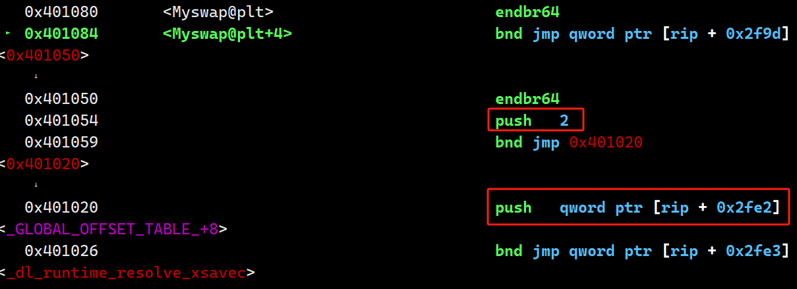
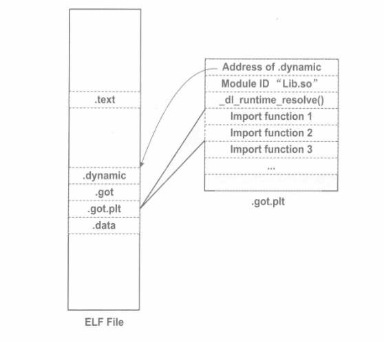

# 为什么要动态链接
​	静态链接可以让不同的开发人员独立开发测试自己的程序模块，从某种意义上来讲大大促进了程序开发的效率，但是随着时间的发展，静态链接的诸多缺点也逐步暴露出来，比如浪费内存和磁盘空间，模块更新困难等，人们不得不寻找另一种更好的方法来组织程序的模块
## 动态链接
​	要解决空间浪费和更新苦难这两个问题最简单的办法就是将程序的模块相互分割开来，形成独立的文件。简单地说，就是不对哪些组成程序的目标文件进行链接，等到程序要运行时才进行链接。也就是说，把链接这个过程推迟到了运行时进行，这就是动态链接的基本思想。

## 程序可拓展性和兼容性
​	动态链接还有一个特点就是程序在运行时可以动态地选择加载各种程序模块，这个优点就是后来被人们用来制作程序的插件。
​	比如某个公司开发完成了某个产品，他按照一定的规则制定好程序的接口，其它公司或开发者可以按照这种接口来编写符合要求的动态链接文件。该产品程序可以动态地载入各种由第三方开发的模块，在程序运行时动态地链接，实现程序功能的扩展。
动态链接还可以加强程序的兼容性。一个程序在不同的平台运行时可以动态地链接到由操作系统提供的动态链接库，这些动态链接库相当于在程序和操作系统之间增加了一个<font color="#f79646">中间层</font>，从而消除了程序对不同平台之间依赖的差异性。

## 动态链接的基本实现
​	动态链接的基本思想是把程序按照模块拆分成各个相对独立部分，在程序运行时才将它们链接在一起形成一个完整的程序。那我们能不能按照按前面的例子中所描述的那样，直接使用目标文件进行动态链接呢？这个问题的答案是：理论上可行，但实际上动态链接的实现方案与直接使用目标文件稍有差别。
动态链接涉及运行时的链接及多个文件的加载，必须由操作系统的支持，因为动态链接的情况下，进程的虚拟地址空间的分布比静态链接情况下更为复杂，还有一些存储管理，内存共享，进程线程等机制在动态链接下也会有一些微妙的变化。linux中一般以.so为拓展名的文件，称为动态共享对象。
在Linux中，常用的C语言库的运行库glibc,它的动态链接形式的版本保存在"/lib"目录下，文件名叫做“libc.so”。整个系统只保留一份C语言库的动态链接文件“libc.so”而所有的C语言编写的动态链接程序都可以在运行时使用它。当程序被装载的时候，系统的动态链接器会将程序所需要的所有动态链接库(最基本的就是libc.so)装载到进程的地址空间，并且将程序中所有未决议的符号绑定到相应的动态链接库中，并进行重定位工作。
程序与libc.so之间真正的链接工作时由动态链接器完成的，而不是由我们前面看到过的静态链接器ld完成的。也就是说，动态链接是把链接这个过程从本来的程序装载前推迟到了程序装载的时候,可是这样的做法虽然很灵活，但是程序每次装载的时候都要进行重新链接，是不是很慢？的确，动态链接会导致程序在性能的一些损失，但是对动态链接的链接过程可以进行优化，比如接下来要介绍的<font color="#f79646">延迟绑定</font>等方法，可以使得动态链接的性能损失尽可能的减少。据估算，动态链接与静态链接相比，性能损失大约在5%，当然，这点性能损失用来换取程序在空间上的节省和程序构建和升级时的灵活性，是相当值得的。

## 动态链接程序运行时地址空间分布
​	还记得静态链接的时候，我们用readelf -s a.o 去查看可重定位文件的符号信息，shared和swap()是UND(未定义)的，当链接器将a.o链接为可执行文件时，重定位这两个符号；但如果现在我们动态链接，这两个符号依旧是UND，当链接器将a.o链接为可执行文件时不会将它们重定位，链接器会将它们符号的引用标记为一个动态链接符号。

​	我们观察一下进程在运行时的内存映射

​	我们看到，整个进程虚拟地址空间中，多出了几个文件映射。b.so与a一样，他们呢都是被操作系统用同样的方法映射至进程的虚拟地址空间，只是它们占据的虚拟地址和长度不同。当然，a除了使用b.so以外，它还用到了动态链接形式的C语言运行库libc-2.31.so .还有一个值得关注的共享对象就是ld-2.31.so ，它实际上是Linux下的动态链接器。动态链接器与普通共享对象一样被映射到了进程的地址空间，在系统开始运行a之前，首先会把控制权交给动态链接器，由他完成所有的动态链接工作以后再把控制权交给a。然后开始执行。

## 地址无关代码
### 固定装载地址的困扰
​	现在基本了解了动态链接的概念，同时，也得到了一个问题，那就是：共享对象在被装载时，如何确定它在进程虚拟地址空间中的位置？
为了实现动态链接，我们首先会遇到的问题就是共享对象地址冲突的问题，我们来回顾一下之前的知识，程序模块的指令和数据中可能会包含一些绝对地址的引用，我们在链接产生输出文件的时候，就要假设模块被装载的目标地址。
​	很明显，在动态链接的情况下，如果不同的模块目标装载地址都是一样是不行的。而对于单个程序来说，我们可以手工指定各个模块的地址，比如把0x1000到0x2000分配给模块A，把地址0x2000到0x3000分配给模块B。但是，如果某个模块被多个程序使用，甚至多个模块被多个程序使用，那么管理这些模块的地址僵尸一件无比繁琐的事情。比如一个很简单的情况，一个人制作了一个程序，该程序要用到模块B，但是不需要用到模块A，所以他以为地址0x1000到0x2000是空闲的，于是分配给了另外一个模块C。这样C和原先的模块A的目标地址就冲突了，任何人以后将不能在同一个程序里面使用模块A和C。想象一个有着成千上万并且由不同公司和个人开发的共享对象的系统中，采用这种手工分配的方式是不可行的。
我们设想是否可以让共享对象在任意地址加载，这个问题另一种表述方法就是：共享对象在编译时不能假设自己在进程虚拟地址空间中的位置，与此不同的时，可执行文件基本可以确定自己在进程虚拟空间中的起始位置，因为可执行文件往往是第一个被加载的文件，他可以选择一个固定空闲的地址。

## -fPIC
​	装载时重定位是解决动态模块中有绝对地址引用的办法之一，但是它有一个很大的缺点是指令部分无法在多个进程之间共享，这样就失去了动态链接节省内存的一大优势。我们还需要有一个更好的方法解决共享对象指令中绝对地址的重定位问题。其实我们的目的很简单，希望程序模块中共享的指令部分在装载时不需要因为装载地址的改变而改变，所以实现的基本想法就是把指令那些需要被修改的部分分离出来，跟数据部分放在一起，这样指令部分就可以保持不变，而数据部分可以在每个进程中拥有一个副本。这种方案就是目前被称为地址无关代码的技术。

## 装载时重定位
​	为了能够使共享对象在任意地址装载，我们首先能想到的方法就是静态链接中的重定位。这个想法的基本思路就是，在链接时，对所有的绝对地址的引用不作重定位，而把这一步推迟到装载时再完成，一旦模块装载地址确定，即目标地址确定，那么系统就对程序中所有的绝对地址引用进行重定位。
假设函数foobar相对于代码段的起始地址时0x100，当模块被装载到0x10000000时，我们假设代码段位于模块的最开始，即代码段的装载地址也是0x10000000，那么我们就可以确定foobar的地址为0x10000100。这时候，系统遍历模块中的重定位表，把所有对foobar的地址引用都重定位至0x100001000.
我们在静态链接时提到过重定位，那时的重定位叫链接时重定位，现在这种情况被称为装载时重定位。
模块间的数据访问目标地址要等到装载时才决定，我们前面提到要使得代码地址无关，基本的思想就是把地址相关的部分当道数据段里，很明显，这些其它的模块的全局变量的地址时跟模块装载地址有关的。ELF的做法时在数据段里建立一个指向这些变量的指针数组，也被称为全局偏移表，当代码需要引用该全局变量时，可以通过GOT表中相应的项间接引用，当指令需要访问某个共享库中的全局变量b时，程序会先找到GOT表，然后根据GOT表中变量所对应的项找到变量的目标地址。每个变量都对应一个地址，链接器在装载模块的时候会查找每个变量所在的地址，然后填充GOT中的各个项，确保每个指针所指向的地址正确。由于GOT表本身时在数据段的，所以它可以在模块装载时被修改，并且每个进程都可以有独立的副本，相互不受影响。
我们来看看GOT如何做到指令的地址无关性，我们可以在编译时确定GOT表相对于当前指令的偏移，通过得到PC值然后加上一个偏移，就可以得到GOT的位置，然后我们根据变量地址在GOT中的偏移就可以得到变量的地址，当然GOT中每个地址对应于哪个变量时由编译器决定的，比如第一个地址对应变量b，第二对应变量c等.

## 延迟绑定(PLT)

​	动态链接有很多优势，比静态链接灵活很多，但它牺牲了一部分性能为代价。

​	我们知道动态链接比静态链接慢的原因是动态链接下对于全局和静态的数据访问都要进行复杂的GOT定位，然后间接寻址；对于模块间的调用也要先定位GOT，然后再进行间接跳转，如此一来，程序的运行速度必定会减慢。另外一个减慢运行速度的原因是动态链接的链接工作在运行时完成，即程序开始执行时，动态链接器要进行一次链接工作，它会寻找并装载所需要的共享对象，然后进行符号查找地址重定位等工作，这些工作会减慢程序的启动速度。这是影响动态链接性能的两个主要问题。我们将介绍一些办法优化这些。

#### 延迟绑定实现

​	 在动态链接下，程序模块之间包含了大量的函数引用(全局变量往往比较少，因为大量的全局变量会导致模块之间耦合度变大)，所以在程序开始执行前，动态链接会消耗不少时间用于解决模块之间的函数引用的符号查找以及重定位，这也是上面提到的问题之一。不过可以想象，在一个程序运行过程中，可能很多函数在程序执行完时都不会被用到，比如一些错误处理函数或者时一些用户很少用到的功能模块等，如果一开始就把所有函数都链接好实际上是一种浪费。所以ELF采用了一种叫做**延迟绑定**的做法，基本思想就是当**函数第一次用到时才进行绑定**（符号查找，重定位等），如果没有用到则不进行绑定。所以程序开始执行时，模块间的函数调用都没有进行绑定，而是需要用到时才由动态链接器来负责绑定。这样的做法可以大大加快程序的启动速度，特别有利于一些大量函数引用和大量模块的程序。

​	ELF使用PLT的方法来实现，这种方法使用了一些很精巧的指令序列来完成。在开始详细介绍PLT之前，我们先从动态链接器的角度来设想一下：假设liba.so需要调用libc.so中的bar()函数，那么当liba.so中第一次调用bar()时，这时候就需要调用动态链接器中的某个函数来完成地址绑定工作，我们假设这个函数叫lookup(),那么lookup()需要知道哪些必要的信息才能完成这个函数的地址绑定工作呢？我想答案很明显，lookup()至少需要知道这个地址绑定发生在哪个模块，哪个函数？那么我们可以假设lookup的原型位lookup(module,function)，这两个参数的值分别位liba.so和bar()。在Glibc中，我们这里的lookup()函数真正的名字叫_dl_runtime_resolve()。

​	当我们调用某个外部模块的函数时，通常的做法应该是通过GOT表中相应的项进行间接跳转。PLT为了实现延迟绑定，这个过程中间又增加了一层间接跳转。调用函数并不直接通过GOT跳转，而是通过一个叫做PLT项的结构来进行跳转。每个外部函数在PLT中都有一个相应的项，比如bar()函数在PLT中的项的地址我们称之为bar@plt。让我们来看看bar@plt的实现：

```assembly
bar@plt
jmp *(bar@GOT)
push n
push moduleID
jump _dl_runtime_resolve
```



bar@plt的第一条指令是一条通过GOT间接跳转的指令。bar@plt表示GOT表中保存bar()这个函数相应的项。如果链接器在初始化阶段以及初始化该项，并且将bar()的地址填入该项，那么这个跳转指令就是我们期望的，跳转到bar()，实现函数正确调用。但是为了实现延迟绑定，链接器在初始化阶段并没有将bar()的地址填入该项，而是将上面代码中第二条指令“push n”的地址填入到bar@GOT表中，这个步骤不需要查找任何符号，所以代价很低。很明显，第一条指令的效果是跳转到第二条指令，相当于没有进行任何操作。第二条指令将一个数字n压入堆栈中，这个数字是bar这个符号引用在重定位表“.got.plt/.got”中的下标。接着又是一条push指令将模块的ID压入到堆栈，然后跳转到_dl_runtime_resolve。这实际上就是在实现我们前面提到的lookup(module，function)这个函数的调用：先将所需要决议符号的下标压入堆栈，再将模块ID压入堆栈，然后调用动态链接器的_dl_runtime_resolve()函数来完成符号解析和重定位工作。_dl_runtime_resolve()在进行一系列工作以后将bar()的真正地址填入到bar@GOT中

​	一旦bar()这个函数被解析完成，当我们再次调用bar@plt时，第一条jmp指令就能够跳转到真正的bar()函数中，bar()函数返回的时候会根据堆栈里面保存的EIP直接返回到调用者，而不会再继续执行bar@plt中第二条指令开始的那段代码，那段代码只会在符号未被解析时执行一次。

​	上面我们描述的时PLT的基本原理，PLT真正的实现要比它的结构稍微复杂一些。ELF将GOT拆分成了两个表叫做".got"和“.got.plt”。其中“.got”用来保存全局变量引用的地址，“.got.plt”用来保存函数引用的地址，也就是说，所有对于外部函数的引用全部被分离出来放到了".got.plt"中。另外“.got.plt”还有一个特殊的地方是它的前三项是有特殊意义的，分别含义如下：

- 第一项保存的是“.dynamic”段的地址，这个段描述了本模块动态链接相关的信息，我们稍后介绍该段

- 第二项保存本模块的ID

- 第三项保存的是_dl_runtime_reslove()的地址

  

  其中第二项和第三项由动态链接器在装载共享模块的时候负责将它们初始化.".got.plt"的其余项分别对应每个外部函数的引用。PLT的结构也与我们示例中的PLT稍有不同，为了减少代码的重复，ELF把上面例子中的最后两条指令放到PLT中的第一项，并且规定每一项长度是16个字节，刚好用来放3条指令，实际的PLT基本结构如图

  

