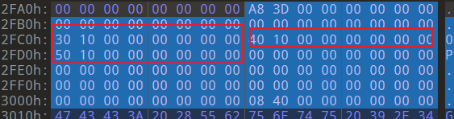
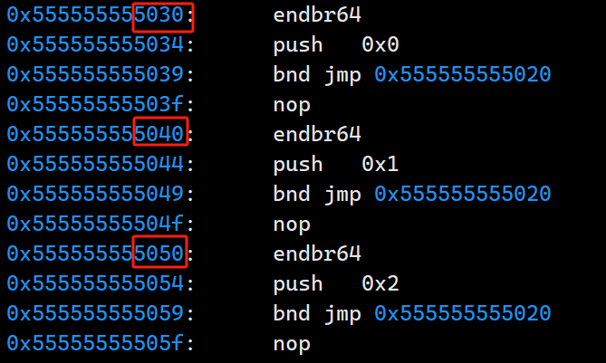
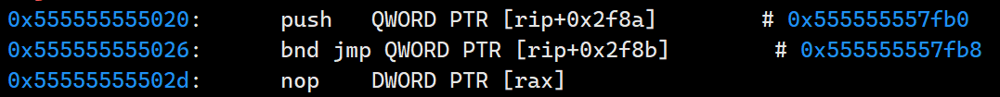
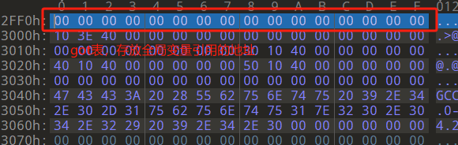
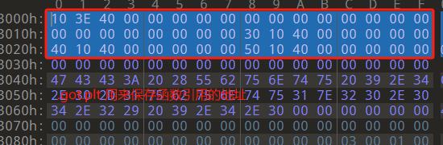
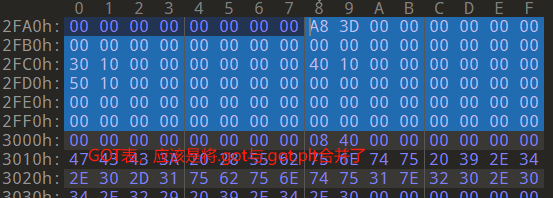
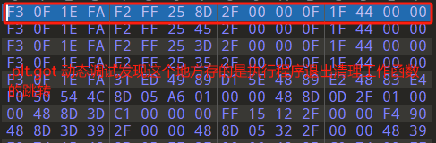

# 1.静态链接后是不是就没有延迟绑定了？

是的，静态链接会将所有的目标文件和库文件的代码合并到一个单独的可执行文件中，因此不涉及动态链接的过程，也就没有延迟绑定的概念。在静态链接的情况下，所有的函数调用在编译时就已经被解析和绑定了，因此不会有延迟绑定的机制。


# 2.可重定位文件中有.rela.text节，可执行文件中就没了，为什么

`.rela.text` 节是一个存储代码段（text segment）中重定位信息的节，用于指示链接器在链接时需要对代码段中的引用进行重定位。这些引用可能是对其他模块中的函数或全局变量的引用。
在生成可重定位文件（object file）时，编译器会在编译时将相应的重定位信息存储在 `.rela.text` 节中，以便在链接时进行处理。这些重定位信息描述了代码段中需要进行重定位的引用，如函数调用或全局变量引用等。
但是，一旦链接器将所有的目标文件链接成可执行文件时，其中的重定位信息就会被整合到可执行文件的其他部分中，而不再保留 `.rela.text` 节。这是因为在可执行文件中，所有的重定位信息已经被处理完毕，不再需要保留原始的重定位表。
因此，在可执行文件中找不到 `.rela.text` 节是正常的，因为链接器在链接时会将其中的重定位信息整合到其他部分中，而不再保留原始的重定位表。


# 3.全局变量的地址是如何计算的

全局变量的地址计算方式在链接时确定，并在可执行文件中被硬编码为一个固定的值。这个地址的计算方式主要取决于链接器的工作方式和目标平台的内存布局。
在链接过程中，链接器会将所有的全局变量的定义和引用进行解析，并将它们映射到可执行文件的合适位置。具体来说，全局变量的地址计算方式通常包括以下几个步骤：

1. **分配存储空间**：

    - 链接器会为每个全局变量分配存储空间，并确定它们在可执行文件中的位置。这个过程通常涉及对数据段（如 `.data` 段）或 BSS 段（如 `.bss` 段）的分配。

2. **地址计算**：
    - 对于已初始化的全局变量，链接器会将它们的地址计算为相对于数据段的偏移量。
    - 对于未初始化的全局变量，链接器会将它们的地址计算为相对于 BSS 段的偏移量。因为 BSS 段中的变量在程序加载时会被初始化为零或空值，所以它们不需要在可执行文件中存储实际的初始值，只需要记录大小即可。
  
3. **重定位**（如果需要）：
    - 在某些情况下，如果全局变量的地址需要进行修正（例如跨模块引用），链接器可能会生成重定位信息，以便在程序加载时进行修正。这种情况下，全局变量的地址计算方式可能会包括额外的修正步骤。
	总之，全局变量的地址计算方式是在链接时确定的，通常涉及到分配存储空间、计算偏移量和可能的重定位操作。这个过程确保了全局变量在可执行文件中有一个固定的地址，以便程序在加载和执行时能够正确地访问它们。
	- 

# 4.静态局部变量与全局局部变量在符号表里的内容

静态局部变量若初始化了，则在符号表中的Ndx为.data段
静态局部变量若没初始化，则在符号表中的Ndx为.bss段
全局静态变量若初始化，在符号表中的Ndx为.bss
全局静态变量若未初始化，在符号表中的Ndx为.data


# 5.符号表中的Value是内存中虚拟地址的偏移，如何找到文件偏移？

查看该符号所属Ndx，找到该节，用符号Value减去节的虚拟地址得到偏移，加上节的文件偏移得到符号的文件偏移。


# 6.我的重定位数据为什么存在了.rela.test中？

看如下代码

```cpp{.line-numbers}
#include <stdlib.h>

extern int shared;
  
int main(){
    int a= 10;
    swap(&a,&shared);  
    return 0;
}
```

正常情况下shared应该存在.rela.test中，但是用objdump -r file.o查看要重定位的地方发现shared和swap的重定位信息都在.rela.test中

```bash{.line-numbers}
❯ objdump -r a.o               

a.o:     file format elf64-x86-64             

RELOCATION RECORDS FOR [.text]:                                                                    
OFFSET                           TYPE                                 VALUE                                                                  
000000000000001a R_X86_64_PC32     shared-0x0000000000000004                                                  
0000000000000027 R_X86_64_PLT32    swap-0x0000000000000004   
```

答：链接器优化了。


# 7.关于重定位条目的结构

利用sizeof(Elf64_Rel)得到的结果是16，但是010editor解析出来的Elf64_Xword s_entsize是 24 


该节指向text段，条目1对应代码段偏移0x1A的位置，对应符号表中的下标为0x0A的符号，不明白的就是这个0xFFFFFFFFFFFFFFFC(临时假地址？)是什么
条目二同理，对应代码段偏移0x27的位置，对应符号表中下标为0x0c的符号
又出现了0xFFFFFFFFFFFFFFFC


# 8.栈空间不够如何拓展

7fffc2633000-7fffc2654000 rw-p 00000000 00:00 0 [stack] 这一行是某个进程的栈空间
当栈空间不够时，操作系统会自动进行栈空间的拓展。这个过程通常是由操作系统内核负责的。当一个线程需要更多的栈空间时，操作系统会自动分配更多的内存，并将当前栈的内容迁移到新分配的内存空间中。
ps:要想解决这个问题，需要深入了解linux内核知识！


# 9.文件中got表中的偏移什么意思

在二进制文件中查看got表


这三个偏移指向plt中，我利用ida查看这三个地方的偏移发现这里是0

动态去跟踪发现这里是这样的代码(程序加载后)


它们都跳转到了5020这个地址上，我们来看一下是什么


这里目前还没搞清楚是什么意思，猜测是第一次解析动态链接函数所需要的函数

# 10.将可执行文件的.got表中的偏移修改后，放入IDA无法识别函数名，识别函数名与.got表有何关联？

<font color="#f79646">未解决</font>


# 11.开启pie与关闭pie链接生成的ptl相关段内容不一样

### 未开启pie

GOT表：



.GOT.PLT:



### 开启PIE

GOT表：



.PLT.GOT表：


