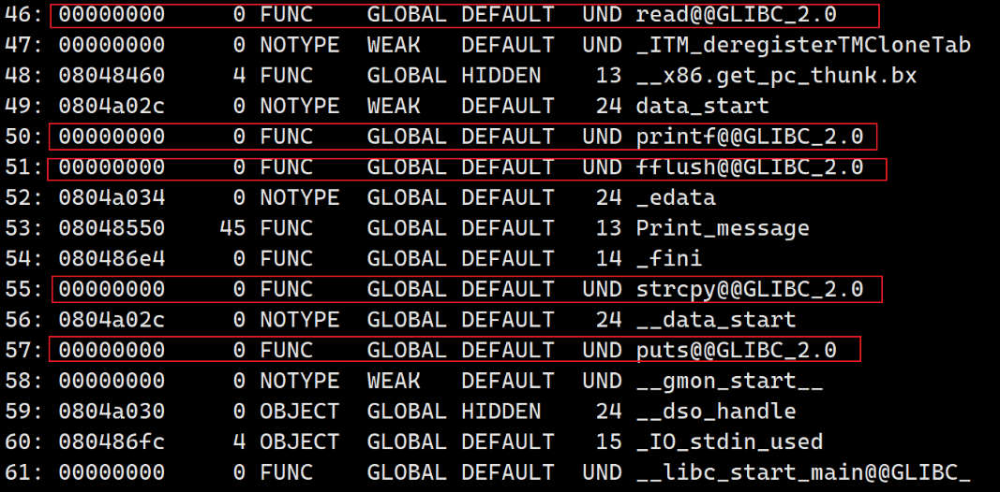
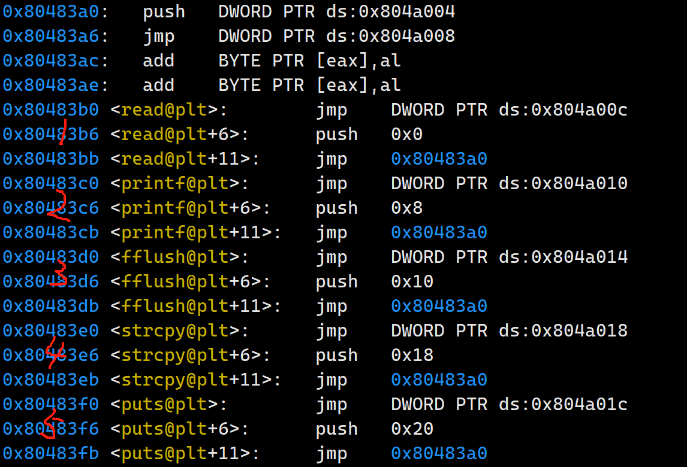

```python
from pwn import *

sh = process('./ret2libc3')
ret2libc3 = ELF('./ret2libc3')

puts_plt = ret2libc3.plt['puts']
libc_start_main_got = ret2libc3.got['__libc_start_main']
main = ret2libc3.symbols['main']
```


### ret2libc3.plt['puts'] 这个是如何实现的？

在回答这个问题前，我首先会去向我如何实现这个方法，首先遍历符号表，但是符号表中外链的函数地址为0，但他们也有一个顺序，这个顺序就是plt表的顺序，这是符号表解析



这是内存中的plt表



如此便对应上了，ret2libc3.plt['puts'] 的地址就是plt+5*0x10的地址

### ret2libc3.got['__libc_start_main'] 这个如何实现的？

同理，根据下标去got.plt表中去找，ret2libc3.got['__libc_start_main']的地址就是got.plt + (3+6)*0x4

### main = ret2libc3.symbols['main'] 这个如何实现的?

遍历符号表即可